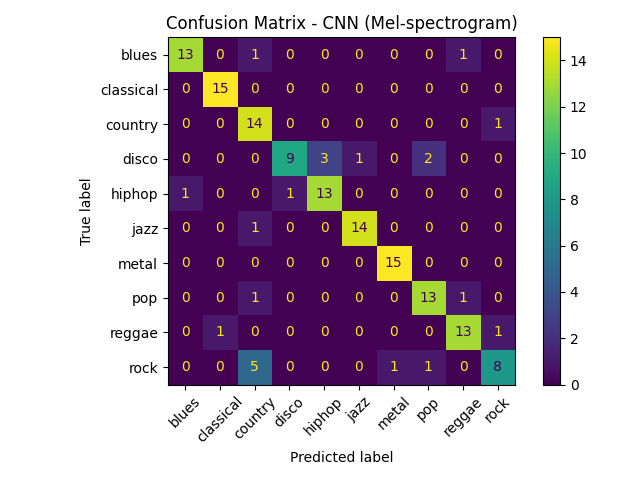
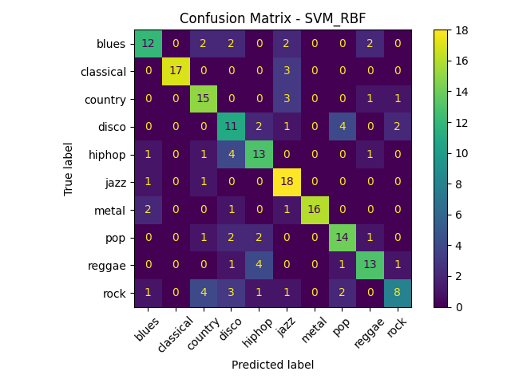

# Music Genre Classification: Classical ML vs CNN

Classifying 30-second tracks from the GTZAN dataset into 10 genres, comparing
hand-crafted audio features with classical models (KNN, SVM, Random Forest) against a
pretrained ResNet18 fine-tuned on log-Mel spectrograms. Includes a command-line
predictor and a Streamlit app that classifies uploaded audio.

## Results

| Model | Input | Test accuracy | Macro-F1 |
|---|---|---|---|
| KNN (k=3) | 35 audio features | 0.595 | 0.599 |
| Random Forest | 35 audio features | 0.565 | 0.560 |
| SVM (RBF) | 35 audio features | 0.685 | 0.686 |
| **ResNet18 (fine-tuned)** | **128-band log-Mel spectrogram** | **0.847** | **0.84** |

Classical models were tuned with 5-fold stratified cross-validation (grid search) and
tested on a stratified 20% split (200 tracks). The CNN uses a 70/15/15 split, so its
test set is 150 tracks. Splits are done per track, so no track appears in both
training and test.

<p align="center">
  
  
</p>

**Reading the confusion matrices.** Classical and metal are recognised almost
perfectly by both models. Rock is the hardest genre (most often confused with
country), and disco gets mixed up with hip-hop and pop. These are the genres whose
boundaries are blurry for human listeners too.

## Approach

**Classical pipeline.** `feature_extraction.py` computes 35 features per track with
librosa: MFCC means and standard deviations (13 + 13), the mean and standard
deviation of spectral centroid, bandwidth, rolloff and zero-crossing rate, and tempo.
One GTZAN file is unreadable, so the feature set has 999 tracks. Models are
scikit-learn pipelines with standardisation, tuned by grid search
(results in [`models/model_benchmark.csv`](models/model_benchmark.csv)).

**Deep learning pipeline.** `train_cnn.py` converts each track to a 128-band log-Mel
spectrogram, treats it as an image and fine-tunes an ImageNet-pretrained ResNet18
with Adam for 20 epochs.

## Caveats

- With 150 test tracks, the 84.7% accuracy has a 95% confidence interval of roughly
  ±6 percentage points, and the two pipelines are evaluated on different test splits.
  The gap between the CNN and the classical models is large enough to be meaningful;
  small differences between the classical models are not.
- GTZAN has known issues (some duplicated or mislabeled clips and repeated artists),
  so results can be optimistic compared with an artist-separated split.

## Project structure

```
├── src/
│   ├── feature_extraction.py   # librosa features -> data/gtzan_features.csv
│   ├── train_models.py         # KNN / SVM / Random Forest with grid search
│   ├── train_cnn.py            # ResNet18 on log-Mel spectrograms
│   └── predict_genre_cnn.py    # command-line inference
├── streamlit_app/app.py        # web app
├── data/gtzan_features.csv     # extracted features
├── models/model_benchmark.csv  # classical model results
└── figures/                    # confusion matrices
```

## How to run

```bash
pip install -r requirements.txt
```

Download GTZAN (for example from Kaggle,
[`andradaolteanu/gtzan-dataset-music-genre-classification`](https://www.kaggle.com/datasets/andradaolteanu/gtzan-dataset-music-genre-classification))
and place the genre folders in `data/gtzan/`. Then, from the project root:

```bash
python src/feature_extraction.py              # only needed to rebuild the CSV
python src/train_models.py                    # classical models
python src/train_cnn.py                       # CNN, saves models/music_genre_cnn.pt
python src/predict_genre_cnn.py song.wav      # top-3 genres for one file
streamlit run streamlit_app/app.py            # upload audio in the browser
```

The app plays the uploaded track, shows its Mel spectrogram and plots the top-3
genre probabilities.

## Next steps

- Data augmentation (time shifts, pitch shifts, SpecAugment masking).
- Split tracks into 3-second segments and vote across them.
- Try pretrained audio models (PANNs, AST) instead of an ImageNet backbone.

## Author

Rayen Latrech · [GitHub](https://github.com/rayenlatrech)
